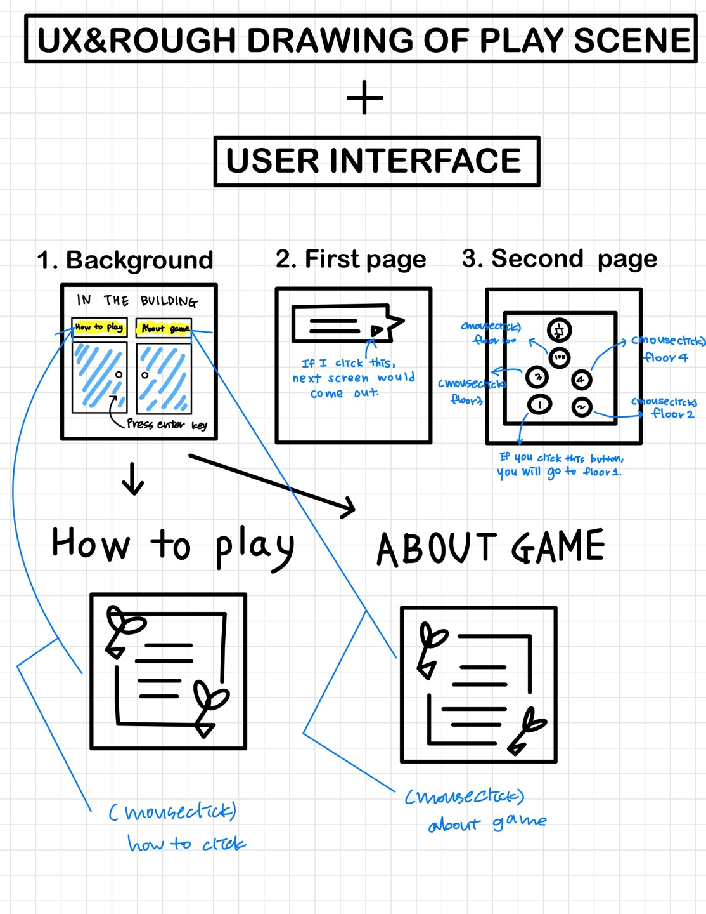

// Name       : Kang Nayun
// Assignment : Make a game
// Course     : CS099
// Spring 2021

FINAL – MAKE A GAME ( DESIGN ) 

# Game concept 

 `Game Name` :  IN THE BUILDING

 `Game Genre` : PUZZLE + ADVENTURE

 `Game Concept` : You (the player) have to escape from the building. 

 There are 4 floor to play the game. On each floor, you can meet the different themes of it. Each game is related to a theme on each 

 floor. The games are There are a total of four floors in the building where you can play games. Each floor has three levels, and when 
 
 you clear a game, you get a hint. There are a total of 12 hints, and you can combine the hints and think of the words to get the key to
 
  the building escape from the 100th floor. The higher level you clear the game, the better you get a hint, and you don't have to clear 
  
  all 12 of them, so you can always go to the 100th floor and try to unlock the key if you think you know it. 

## Game concept2

`GAME THEME ` : **Take One, Leave The Rest** / Puzzle / Adventure / Escape from the building 

`Setting` : In the building

`Scenario` : You (the player) heard the rumor that there are lots of gold and silver treasure in the building. You decided to go inside 

and find them. However, the moment he entered the building, the door closed and nothing but the elevator was visible. There are only 1,2,

3,4,100 floors in the elevator. You are going to get a hint and try to escape to the 100th floor. To escape in a short period of time, 

you need to get as few keys as you can with as little hint. That's exactly what **Take One, Leave The Rest**! There are two attacks. One

 is to get various hints by targeting easy levels, and the other is to get decisive hints by targeting difficult levels. It's up to your 
 
 choice.

### UX & Rough drawing of play scene

 `UX & ROUGH DRAWING OF PLAY SCENE` + `USER INTERFACE` : 

 `FLOW CHART` :

 `CONCEPT IMAGE` : 
